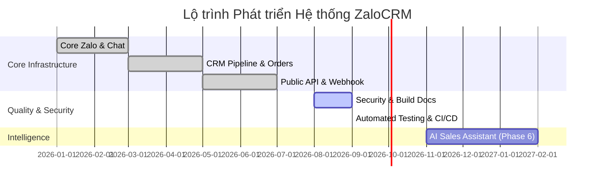

# ZaloCRM — Product & Technical Development Roadmap

## 1. Tổng Quan Lộ Trình (Roadmap Summary)

Lộ trình phát triển **ZaloCRM** được chi làm 6 giai đoạn chiến lược, tập trung từ việc ổn định kết nối đa Zalo cá nhân, mở rộng tính năng CRM quản lý khách hàng, tích hợp API công khai cho tới nâng cao hạ tầng bảo mật, tự động hóa kiểm thử và tích hợp trí tuệ nhân tạo (AI Assistant).

---

## 2. Chi Tiết Các Giai Đoạn (Detailed Phases)

### Phase 1: Core Multi-Zalo & Real-time Chat (ĐÃ HOÀN THÀNH)
- [x] Quản lý đa tài khoản Zalo cá nhân (Đăng nhập QR, lưu session AES-256).
- [x] Giao diện Live Chat real-time qua Socket.IO (gửi/nhận tin nhắn, ảnh, file, sticker, hội thoại nhóm).
- [x] Phân quyền người dùng (Owner, Admin, Member) và bảng kiểm soát truy cập Zalo (`ZaloAccountAccess`).

### Phase 2: CRM Pipeline, Appointments & Reports (ĐÃ HOÀN THÀNH)
- [x] Đường ống quản lý khách hàng (Pipeline 5 trạng thái).
- [x] Đặt lịch hẹn và tự động nhắc lịch hẹn chạy ẩn hàng ngày (`startAppointmentReminder`).
- [x] Thống kê Dashboard & Xuất báo cáo hiệu suất ra file Excel (`exceljs`).

### Phase 3: Public REST API & Webhook Gateway (ĐÃ HOÀN THÀNH)
- [x] Khởi tạo hệ thống REST API công khai xác thực bằng `X-API-Key`.
- [x] Hệ thống gửi thông báo sự kiện qua Webhook cho ứng dụng bên ngoài.

---

### Phase 4: Hardening Bảo Mật & Chuẩn Hóa Quy Trình Build (ĐANG THỰC HIỆN)
- [ ] Đóng các finding từ audit toàn bộ codebase ngày 2026-08-31; scan và báo cáo đã hoàn tất, remediation chưa thực hiện.
- [x] Đồng bộ các lệnh build, dev, typecheck thông qua file `package.json` tại root repository.
- [x] Sửa tenant/RBAC/ACL ở Orders, Zalo, Chat, Socket.IO và AI Reports; member vẫn xem toàn bộ contact nhưng dữ liệu Zalo/AI phải theo account ACL.
- [x] Chặn SSRF ở webhook/attachment downloader và giới hạn tài nguyên parser/download stream.
- [x] Chuẩn hóa một root workspace `package-lock.json`; bỏ dependency vào lockfile backend/frontend riêng và dùng cùng graph trong Docker/CI.
- [x] Nâng Node.js 20 đã EOL; Node.js 24 LTS đã áp dụng. Hai advisory upstream trong Prisma 7.10 được chấp nhận có điều kiện và phải đánh giá lại mỗi Prisma release.
- [x] Chuyển AI Reports khỏi model `gemini-2.0-flash` đã shutdown sang `GEMINI_MODEL` được provider xác thực lúc startup; có `npm run ai:smoke --workspace=backend` cho môi trường có API key.
- [x] Chuyển đổi quy trình Docker Production sang `prisma migrate deploy` nâng cao tính toàn vẹn dữ liệu.
- [x] Áp dụng tài khoản phi đặc quyền `USER node` trong container ứng dụng.

---

### Phase 5: Kiểm Thử Tự Động & CI/CD Pipeline (HOÀN THÀNH 09/2026)
- [x] Bổ sung Vitest unit/contract tests cho policy outbound, secret codec, AI job bounds và các security/runtime invariant P1.
- [x] Bổ sung browser smoke Playwright xác nhận login route không khôi phục bearer token qua persistent storage.
- [x] Tích hợp GitHub Actions (`.github/workflows/ci.yml`) chạy root `npm ci`, typecheck, backend test, build, production audit, Playwright smoke và Docker build trên pull request/main.
- [ ] Mở rộng integration database corpus cho tenant isolation, role downgrade, Socket.IO room authorization, webhook và message idempotency khi disposable PostgreSQL fixture được chuẩn hóa.

---

### Phase 6: Tích Hợp AI Sales Assistant (KẾ HOẠCH BẮT ĐẦU 11/2026)
- [ ] Tích hợp LLM API (Claude 3.5 Sonnet / Gemini 1.5 Pro) gợi ý câu trả lời tự động cho nhân viên tư vấn.
- [ ] Tự động phân tích tâm lý khách hàng (Sentiment Analysis) và tóm tắt nội dung cuộc trò chuyện dài.
- [ ] Tự động trích xuất thông tin khách hàng từ tin nhắn hội thoại để tạo hồ sơ Contact / Order tự động.
