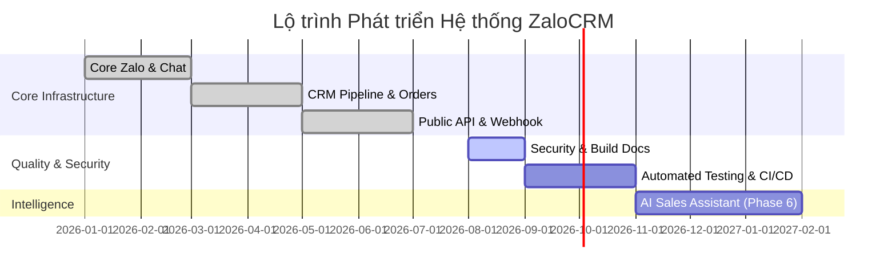

# ZaloCRM — Product & Technical Development Roadmap

## 1. Tổng Quan Lộ Trình (Roadmap Summary)

Lộ trình phát triển **ZaloCRM** được chi làm 6 giai đoạn chiến lược, tập trung từ việc ổn định kết nối đa Zalo cá nhân, mở rộng tính năng CRM quản lý khách hàng, tích hợp API công khai cho tới nâng cao hạ tầng bảo mật, tự động hóa kiểm thử và tích hợp trí tuệ nhân tạo (AI Assistant).

---

## 2. Chi Tiết Các Giai Đoạn (Detailed Phases)

### Phase 1: Core Multi-Zalo & Real-time Chat (ĐÃ HOÀN THÀNH)
- [x] Quản lý đa tài khoản Zalo cá nhân (Đăng nhập QR, lưu session AES-256).
- [x] Giao diện Live Chat real-time qua Socket.IO (gửi/nhận tin nhắn, ảnh, file, sticker, hội thoại nhóm).
- [x] Phân quyền người dùng (Owner, Admin, Member) và bảng kiểm soát truy cập Zalo (`ZaloAccountAccess`).

### Phase 2: CRM Pipeline, Appointments & Reports (ĐÃ HOÀN THÀNH)
- [x] Đường ống quản lý khách hàng (Pipeline 5 trạng thái).
- [x] Đặt lịch hẹn và tự động nhắc lịch hẹn chạy ẩn hàng ngày (`startAppointmentReminder`).
- [x] Thống kê Dashboard & Xuất báo cáo hiệu suất ra file Excel (`exceljs`).

### Phase 3: Public REST API & Webhook Gateway (ĐÃ HOÀN THÀNH)
- [x] Khởi tạo hệ thống REST API công khai xác thực bằng `X-API-Key`.
- [x] Hệ thống gửi thông báo sự kiện qua Webhook cho ứng dụng bên ngoài.

---

### Phase 4: Hardening Bảo Mật & Chuẩn Hóa Quy Trình Build (ĐANG THỰC HIỆN)
- [x] Audit toàn bộ mã nguồn và khởi tạo bộ tài liệu kỹ thuật chuẩn tại `./docs/`.
- [x] Đồng bộ các lệnh build, dev, typecheck thông qua file `package.json` tại root repository.
- [ ] Chuyển đổi quy trình Docker Production sang `prisma migrate deploy` nâng cao tính toàn vẹn dữ liệu.
- [ ] Áp dụng tài khoản phi đặc quyền `USER node` trong container ứng dụng.

---

### Phase 5: Kiểm Thử Tự Động & CI/CD Pipeline (KẾ HOẠCH BẮT ĐẦU 09/2026)
- [ ] Bổ sung kịch bản Unit Test cho Backend (Fastify routes & services) sử dụng Vitest.
- [ ] Bổ sung End-to-End Test cho Frontend sử dụng Playwright.
- [ ] Tích hợp GitHub Actions Workflows (`.github/workflows/ci.yml`) tự động lint, typecheck, test và build Docker image mỗi khi push code lên nhánh `main`.

---

### Phase 6: Tích Hợp AI Sales Assistant (KẾ HOẠCH BẮT ĐẦU 11/2026)
- [ ] Tích hợp LLM API (Claude 3.5 Sonnet / Gemini 1.5 Pro) gợi ý câu trả lời tự động cho nhân viên tư vấn.
- [ ] Tự động phân tích tâm lý khách hàng (Sentiment Analysis) và tóm tắt nội dung cuộc trò chuyện dài.
- [ ] Tự động trích xuất thông tin khách hàng từ tin nhắn hội thoại để tạo hồ sơ Contact / Order tự động.
