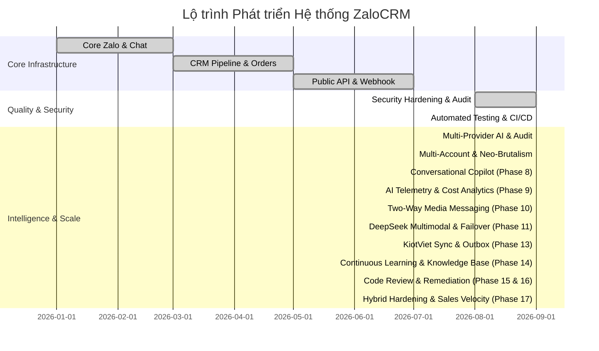

# ZaloCRM — Product & Technical Development Roadmap

## 1. Tổng Quan Lộ Trình (Roadmap Summary)

Lộ trình phát triển **ZaloCRM** được chi làm 6 giai đoạn chiến lược, tập trung từ việc ổn định kết nối đa Zalo cá nhân, mở rộng tính năng CRM quản lý khách hàng, tích hợp API công khai cho tới nâng cao hạ tầng bảo mật, tự động hóa kiểm thử và tích hợp trí tuệ nhân tạo (AI Assistant).

---

## 2. Chi Tiết Các Giai Đoạn (Detailed Phases)

### Phase 1: Core Multi-Zalo & Real-time Chat (ĐÃ HOÀN THÀNH)
- [x] Quản lý đa tài khoản Zalo cá nhân (Đăng nhập QR, lưu session AES-256).
- [x] Giao diện Live Chat real-time qua Socket.IO (gửi/nhận tin nhắn, ảnh, file, sticker, hội thoại nhóm).
- [x] Phân quyền người dùng (Owner, Admin, Member) và bảng kiểm soát truy cập Zalo (`ZaloAccountAccess`).

### Phase 2: CRM Pipeline, Appointments & Reports (ĐÃ HOÀN THÀNH)
- [x] Đường ống quản lý khách hàng (Pipeline 5 trạng thái).
- [x] Đặt lịch hẹn và tự động nhắc lịch hẹn chạy ẩn hàng ngày (`startAppointmentReminder`).
- [x] Thống kê Dashboard & Xuất báo cáo hiệu suất ra file Excel (`exceljs`).

### Phase 3: Public REST API & Webhook Gateway (ĐÃ HOÀN THÀNH)
- [x] Khởi tạo hệ thống REST API công khai xác thực bằng `X-API-Key`.
- [x] Hệ thống gửi thông báo sự kiện qua Webhook cho ứng dụng bên ngoài.

---

### Phase 4: Hardening Bảo Mật & Chuẩn Hóa Quy Trình Build (ĐÃ HOÀN THÀNH)
- [x] Đóng toàn bộ 10 phát hiện (4 HIGH, 5 MEDIUM, 1 LOW) từ đợt audit sau remediation (commit `d075642`).
- [x] Đồng bộ các lệnh build, dev, typecheck thông qua file `package.json` tại root repository.
- [x] Sửa tenant/RBAC/ACL ở Orders, Zalo, Chat, Socket.IO và AI Reports; member vẫn xem toàn bộ contact nhưng dữ liệu Zalo/AI phải theo account ACL.
- [x] Chặn SSRF ở webhook/attachment downloader (`outbound-url-policy.ts`) và giới hạn tài nguyên parser/download stream.
- [x] Chuẩn hóa một root workspace `package-lock.json`; bỏ dependency vào lockfile backend/frontend riêng và dùng cùng graph trong Docker/CI.
- [x] Nâng Node.js 20 đã EOL; Node.js 24 LTS đã áp dụng. Hai advisory upstream trong Prisma 7.10 được chấp nhận có điều kiện qua allowlist nghiêm ngặt (`scripts/audit-production-policy.mjs`).
- [x] Chuyển đổi quy trình Docker Production sang `prisma migrate deploy` với image migrator độc lập, nâng cao tính toàn vẹn dữ liệu.
- [x] Áp dụng tài khoản phi đặc quyền `USER node` trong container ứng dụng và cấu hình loopback port binding.

---

### Phase 5: Kiểm Thử Tự Động & CI/CD Pipeline (ĐÃ HOÀN THÀNH)
- [x] Bổ sung Vitest unit/contract tests cho policy outbound, secret codec, AI job bounds, media attachments, copilot debouncer, action items parser, KiotViet invoice/client/settings, AI knowledge base & feedback distillation và các security/runtime invariant (bộ test đạt **573 unit tests** sạch sẽ: 404 backend + 169 frontend).
- [x] Bổ sung browser smoke Playwright (10 spec files) xác nhận login route, QR intent, chat recovery, target qualification và không khôi phục bearer token qua persistent storage.
- [x] Bổ sung bộ **55 integration test suites** chạy trên PostgreSQL 16 disposable cho tenant isolation, socket delivery, message replay/undo, order code counter, AI budget/resend, worker fencing, idempotency và KiotViet outbox.
- [x] Tích hợp GitHub Actions (`.github/workflows/ci.yml`) chạy root `npm ci`, typecheck, backend test, build, production audit, Playwright smoke và Docker build trên pull request/main.
- [x] Bổ sung các kịch bản kiểm chứng container smoke: `npm run verify:production-container` và `npm run verify:development-compose`.

---

### Phase 6: Multi-Provider AI Engine & Báo Cáo Giám Sát Nhóm (ĐÃ HOÀN THÀNH)
- [x] **Hạ tầng AI Đa Nhà Cung Cấp (Multi-Provider Engine):** Hỗ trợ Google Gemini, OpenAI (GPT-4o/mini), DeepSeek (Chat/Reasoner), và Custom OpenAI-Compatible Gateway (Ollama/vLLM/LiteLLM) với cơ chế tự động chuyển vùng dự phòng (Failover) và đo độ trễ (latency tracking).
- [x] **Bảo vệ Mạng & Phòng Chống SSRF:** Module `validateCustomAiGatewayUrl` cô lập triệt để hạ tầng mạng nội bộ; cấm truy cập private IPs/loopback/cloud metadata trừ khi biến `ALLOW_PRIVATE_AI_GATEWAYS=true` được bật tường minh.
- [x] **Lấy Mẫu Đa Phương Thức Đột Biến (Multimodal Burst Sampling):** Pool worker 4 kết nối đồng thời, giới hạn tệp ảnh đính kèm 12MB, khử trùng lặp URL nguồn, và bộ lọc khử khuẩn phòng ngừa Prompt Injection (`sanitizeConversationHistory`).
- [x] **Đối Soát Chéo Hai Tầng (Two-Tier Cross-Verification):**
  - Tầng 1: Chỉ thị kiểm toán đối soát hình ảnh và hội thoại trực quan.
  - Tầng 2: Trích xuất nhiệm vụ hành động chuẩn hóa JSON (`[TASKS_JSON]`) gồm tiêu đề, mức độ ưu tiên (`high`, `medium`, `low`), người phụ trách, hạn chót.
- [x] **Lập Lịch Kiểm Toán Tự Động (AI Group Audit Rules):** Hỗ trợ lập lịch định kỳ tự động phân tích các nhóm Zalo vận hành trọng yếu và tạo báo cáo AI độc lập.
- [x] **Phát Tin Nhiệm Vụ Đến Nhóm Zalo (Action Items Broadcast):** Endpoint `POST /api/v1/ai-reports/:id/broadcast-tasks` cho phép chọn tài khoản phát tin và nhóm Zalo nhận việc trực tiếp từ giao diện báo cáo với báo cáo tiến độ thời gian thực.

---

### Phase 7: Nâng Tầm Trải Nghiệm Đa Tài Khoản & Chuẩn Giao Diện CQA Neo-Brutalism (ĐÃ HOÀN THÀNH)
- [x] **Thanh Điều Hướng Đa Tài Khoản Dọc (`AccountRail.vue`):** Hiển thị trực quan toàn bộ tài khoản Zalo kết nối với avatar, monogram thông minh, chấm trạng thái trực tuyến/ngoại tuyến, số đếm tin chưa đọc hợp nhất (`ALL`) và riêng biệt.
- [x] **Phân Loại Chi Nhánh & Bảng Màu Nhận Diện (`branchTag` & `colorTag`):** Bổ sung trường dữ liệu `branchTag` và `colorTag` trong Prisma Schema; hỗ trợ bảng màu 12 sắc thái Neo-Brutalism với thuật toán băm xác định màu và tự động tính tương phản chữ.
- [x] **Đồng Bộ Tin Nhắn Gửi Đi Từ Thiết Bị Ngoài (`selfListen: true`):** Lắng nghe và đồng bộ hóa lập tức các tin nhắn gửi đi từ điện thoại/máy tính cá nhân của nhân viên vào CRM theo cơ chế `idempotent upsert` kèm phát Socket real-time.
- [x] **Tự Phục Hồi Danh Bạ (Self-Healing Contacts):** Cơ chế tự động bù đắp và cập nhật tên hiển thị, ảnh đại diện Zalo của khách hàng khi tiếp nhận gói tin nhắn mới.
- [x] **Ngôn Ngữ Thiết Kế Neo-Brutalism Chuẩn CQA:** Loại bỏ 100% bóng mờ (zero shadow), áp dụng viền cơ học 1.5px, chuẩn hóa bán kính bo góc CQA (12px cho cards/dialogs/tables/chat bubbles, 8px cho nút/inputs, 9999px cho pills), phông chữ Space Grotesk in nghiêng đậm và bộ 41 Custom SVG Icons.

---

### Phase 8: Trợ Lý Ảo Bán Hàng & Tự Động Hóa Hội Thoại Nâng Cao (ĐÃ HOÀN THÀNH)
- [x] **Single-Inference Unified Copilot Engine:** Khởi tạo kiến trúc 1 lần suy luận duy nhất sinh toàn bộ 4 chiều thông tin (insights, smartReplies, quickDraft, anomalyAlert) với độ trễ < 1.5s, tiết kiệm 75% token, bọc thẻ XML `<customer_utterance>` triệt tiêu injection, bộ nhớ đệm In-Memory LRU Cache (500 mục, 5m TTL).
- [x] **Smart Conversation Turn Debouncer (3.0s):** Cơ chế trễ thông minh tự động gom tin nhắn khách, huỷ bộ hẹn giờ ngay khi nhân viên gửi phản hồi (`isSelf: true`), trần đợi tối đa (12s ceiling) và kiểm soát trùng lặp token suy luận.
- [x] **Chat Copilot Bar & Smart Reply Chips UI:** Thanh trợ lý phía trên compose bar với Neo-Brutalism pills (Sentiment, Buying Intent score), 3 Smart Reply chips gán phím tắt `Alt + 1/2/3`, click 1 lần chèn văn bản vào input an toàn.
- [x] **AI Draft Card Human-in-the-Loop:** Tự động trích xuất liên hệ, địa chỉ giao hàng, sản phẩm gợi ý và lịch hẹn; hiển thị thẻ thao tác nhanh để nhân viên click mở modal tạo đơn hàng/lịch hẹn đã điền sẵn 100% dữ liệu hoặc lưu địa chỉ vào danh bạ (không tự ý commit DB).
- [x] **Cảnh Báo Bất Thường & Leo Thang Quản Lý (Anomaly Escalation):** Banner nguy hiểm Neo-Brutalism cảnh báo xung đột/khiếu nại kèm kịch bản xoa dịu mẫu, huy hiệu `⚠️ KHIẾU NẠI` trên danh sách hội thoại, gửi thông báo Socket khẩn tới Owner/Admin và ghi nhật ký kiểm toán `ActivityLog`.

---

### Phase 9: Đo Lường & Quản Lý Chi Phí AI (AI Telemetry & Cost Analytics) (ĐÃ HOÀN THÀNH)
- [x] **Mô Hình Dữ Liệu Chi Phí AI (`AiUsageLog` & `DailyAiUsageStat`):** Bổ sung 2 bảng chuyên dụng trong Prisma Schema lưu trữ chi tiết từng lượt suy luận và tổng hợp chỉ số theo ngày/tính năng/mô hình.
- [x] **Danh Mục Giá & Bảng Quy Đổi Tiền Tệ (`ai-pricing-catalog.ts`):** Ánh xạ giá token input/output/cached chi tiết của Gemini, OpenAI, DeepSeek; tính toán chính xác chi phí USD và VNĐ.
- [x] **Tổng Hợp Số Liệu Nguyên Tử (Atomic Upsert):** Sử dụng raw query PostgreSQL `INSERT ... ON CONFLICT (org_id, stat_date, feature, provider, model) DO UPDATE` cộng dồn trực tiếp, loại trừ race condition.
- [x] **Giao Diện Trực Quan & Xuất Báo Cáo:** Thẻ `AiCostKpiCard.vue` trên Dashboard, tab `AiUsageReportTab.vue` trong phân hệ AI Reports và endpoint xuất file Excel `.xlsx` phục vụ đối soát tài chính (`GET /api/v1/reports/export?type=ai-usage`).

---

### Phase 10: Tin Nhắn Đa Phương Tiện Hai Chiều & Khay Chờ Đính Kèm (Two-Way Media Messaging) (ĐÃ HOÀN THÀNH)
- [x] **Khay Chờ Đính Kèm Thông Minh (`StagedMediaBar.vue`):** Hỗ trợ kéo thả, chọn tệp hoặc dán trực tiếp ảnh từ Clipboard (`Ctrl+V`), hiển thị thumbnail xem trước, tiến độ tải lên và nút hủy từng tệp/toàn bộ.
- [x] **Hạ Tầng Tải Lên Độc Lập Theo Tenant:** Tệp staged lưu tại `uploads/attachments/staged/` với tên định danh `${orgId}-${uuid}-${sanitizedName}`, xác thực sâu chữ ký magic bytes (`image-size`), chặn tệp giả mạo.
- [x] **Vé Streaming HMAC-SHA256 (60s):** Cơ chế sinh ticket ngắn hạn cho phép Zalo CDN nạp dữ liệu media qua endpoint công khai có ký số mà không để lộ token xác thực người dùng.
- [x] **Hộp Thoại Phóng To Ảnh Chuẩn CQA (`MediaLightboxDialog.vue`):** Giao diện phẳng 100% Zero Shadow, đường viền 2px cơ học dứt khoát, hỗ trợ xem ảnh nét căng và tải về tệp gốc.
- [x] **Tác Vụ Dọn Dẹp Định Kỳ (Orphan Cleanup Task):** Cron job chạy mỗi giờ (`0 * * * *`) tự động quét và xóa sạch các tệp staged mồ côi tồn tại quá 2 giờ.

---

### Phase 11: DeepSeek Primary Multimodal & Chuỗi Failover Đa Tầng (ĐÃ HOÀN THÀNH)
- [x] **DeepSeek Native Multimodal Vision (`deepseek-flash`):** Nâng cấp adapter `OpenAiCompatibleProvider` nhận diện và gửi mảng `image_url` trực tiếp dạng base64 data URL; tự động kích hoạt `supportsVision: true` khi dùng model flash kể cả khi bản ghi DB cũ lưu `false`.
- [x] **Chuỗi Chuyển Vùng Dự Phòng Đa Tầng (3-Tier Failover Chain):** Cấu hình mặc định toàn hệ thống sang DeepSeek (Chính) -> Gemini (Dự phòng 1) -> OpenAI (Dự phòng 2); áp dụng đồng bộ cho cả AI Reports và Chat Copilot.
- [x] **Lọc Bỏ Model Text Cũ & Bảng Giá Chi Phí Chuẩn Xác:** Loại bỏ `deepseek-chat` và `deepseek-reasoner` khỏi danh mục gợi ý và luồng refresh model, nhưng bảo lưu trong `AI_PRICING_TABLE` cho telemetry tương thích ngược. Bổ sung giá `deepseek-flash` ($0.15 input, $0.003 cached, $0.60 output).
- [x] **Loại Trừ Deadlock Bộ Điều Phối AI (Deadlock Prevention):** Cập nhật `getVisionProvider(excludeType)` bỏ qua provider vừa gặp sự cố khi kích hoạt OCR Bridge dự phòng.
- [x] **Vá Lỗi Unicode Null Byte (Postgres 22P05):** Hàm `sanitizeJsonNullBytes` đệ quy với chốt chặn an toàn `maxDepth = 20`, fallback duyệt lặp và try/catch error boundary bảo vệ worker xử lý tệp đính kèm.

---

### Phase 12: Khắc Phục Edge Cases & Tối Ưu Hóa Toàn Diện Codebase (ĐÃ HOÀN THÀNH)
- [x] **Khắc Phục 8 Nhóm Edge Cases Trọng Yếu (P1/P2):**
  - [x] Đồng bộ hóa Timezone UTC+7: chuẩn hóa `getVnDateString()` và `getVnDayStartUtc()` cho rate limit Zalo và thống kê đơn hàng hôm nay từ 00:00 VN.
  - [x] Loại bỏ hoàn toàn quét đĩa cross-tenant và quét `stagedDir` khi xử lý attachments trong `attachment-routes.ts`, trả về 404 O(1) chống DoS I/O.
  - [x] Tích hợp In-Memory Bounded LRU Cache cho `AppSetting` và AI Credentials với defensive cloning, giảm 99% query DB.
  - [x] Bổ sung nhận diện sự kiện thu hồi tin nhắn trong nhóm Zalo (`threadId = data.threadId || data.groupId || data.data?.threadId || data.data?.groupId`).
  - [x] Nâng trần giá trị đơn hàng lên 100 tỷ VNĐ.
  - [x] Khôi phục tiến trình tải attachment lúc khởi động server (`recoverPendingAttachmentDownloads`).
  - [x] Giải quyết xung đột xoay vòng Refresh Token đa tab bằng Web Locks API (`navigator.locks`) phía client.
  - [x] Xử lý lỗi fatal `ReportControlError` khi failover AI xảy ra sau khi reservation đã hoàn tất.

---

### Phase 13: Tích Hợp Đồng Bộ Hóa Đơn & Danh Mục Sản Phẩm KiotViet (ĐÃ HOÀN THÀNH)
- [x] **Cơ Sở Dữ Liệu & Khóa Phân Tán (Schema & Leases):**
  - Bổ sung các model: `OrderItem`, `KiotvietProduct`, `KiotvietSyncState`, `KiotvietRateLimitBucket`, `KiotvietRetailerLease`, `KiotvietInvoiceJob` và các trường hóa đơn trên `Order`.
  - Hỗ trợ phân quyền giá bán và chiết khấu (Admin/Owner được chỉnh sửa, Member áp dụng giá niêm yết).
  - Khóa tài chính bất biến (`order-invoice-lock.ts`) ngăn chặn chỉnh sửa giá, số lượng, phương thức thanh toán hoặc hủy/xóa đơn khi hóa đơn KiotViet ở trạng thái `pending`, `uncertain` hoặc `synced`.
- [x] **API Client KiotViet & Quản Lý Danh Mục:**
  - Triển khai OAuth2 token rotation tự động với single-flight deduplication, TTL safety margin và thử lại 1 lần khi gặp 401.
  - Quản lý hạn mức gọi API (180 req/phút/retailer) với thuật toán Token Bucket và tự động backoff khi gặp 429.
  - Worker đồng bộ danh mục sản phẩm nền (`kiotviet-catalog-worker.ts`) theo con trỏ `modifiedDate` kèm cửa sổ gối đầu 5 phút, lưu trữ phân vùng theo `(orgId, retailer, branchId)`.
  - Tìm kiếm sản phẩm KiotViet 100% trên PostgreSQL nội bộ, không tạo HTTP request sang KiotViet khi gõ tìm kiếm.
  - Giới hạn phạm vi: Chỉ cho phép xuất hóa đơn các sản phẩm thông thường (`productType: 'normal'`), từ chối sản phẩm dạng lô/serial/combo.
- [x] **Durable Invoice Outbox & Đối Soát Hóa Đơn:**
  - Quy trình trạng thái hóa đơn: `queued` → `preparing` → `dispatching` → `succeeded` / `failed` / `uncertain`.
  - Cam kết bất biến: Commit trạng thái `dispatching` vào PostgreSQL trước khi gửi request tới KiotViet.
  - Khi gặp lỗi mạng/timeout/5xx, chuyển trạng thái sang `uncertain` và **tuyệt đối không tự động retry**.
  - Quy trình đối soát hóa đơn dành riêng cho Admin/Owner: `link` (khớp hóa đơn đã có), `confirm-not-created` (xác nhận chưa tạo để mở khóa đơn), `refresh` (cập nhật từ KiotViet).
- [x] **Nhận Diện Khách Hàng & Tiền Thực Thu Độc Lập:**
  - Tra cứu khách hàng KiotViet theo số điện thoại chuẩn hóa; tự động khớp nếu tìm thấy 1 khách, hiển thị danh sách chọn nếu trùng nhiều khách, cho phép tạo mới hoặc xuất khách lẻ nếu chưa có.
  - Quản lý `paidAmount` và `paymentMethod` độc lập với trạng thái đơn hàng (hỗ trợ chưa thu, thu một phần, thu đủ).
- [x] **Giao Diện Người Dùng Chuẩn CQA Neo-Brutalism:**
  - Component `OrderItemsSelector.vue`: Tìm kiếm sản phẩm có debounce, điều chỉnh số lượng, giá và chiết khấu, tự động tính tổng tiền VNĐ.
  - Component `OrderPaymentFields.vue`: Nhập tiền thực thu, chọn hình thức thanh toán và tài khoản nhận tiền.
  - Component `OrderKiotvietStatus.vue`: Huy hiệu trạng thái, sao chép mã hóa đơn, tooltip lỗi, polling tự động và nút xuất hóa đơn.
  - Component `KiotvietReconcileDialog.vue`: Hộp thoại đối soát hóa đơn an toàn cho Admin.
  - Component `KiotvietCustomerPicker.vue`: Tìm và chọn khách hàng KiotViet có hỗ trợ phân xử trùng lặp.
  - Component `KiotvietSettingsCard.vue` & `KiotvietCatalogSyncPanel.vue`: Quản lý cấu hình, kiểm tra kết nối với thông tin draft, kích hoạt đồng bộ danh mục và theo dõi tiến độ.
  - Phân quyền giao diện: Tab KiotViet và các tính năng cấu hình/đối soát chỉ hiển thị cho Admin/Owner.

---

### Phase 14: Học Hỏi Liên Tục & Kho Tri Thức Vận Hành 3 Cấp (ĐÃ HOÀN THÀNH)
- [x] **Cơ Sở Dữ Liệu & Phân Cấp Tri Thức (Data Models & 3-Tier Hierarchy):**
  - Bổ sung các model: `AiKnowledgeRule` (quản trị tri thức 3 cấp: Org, Branch, Group) và `AiReportFeedback` (tiếp nhận góp ý, liên kết quy tắc chắt lọc).
  - Khóa ngoại tổng hợp bảo vệ phân lập dữ liệu đa tổ chức `(orgId, id)`.
  - Phân loại tri thức thực tế: `personnel` (nhân sự & vai trò), `sop` (quy trình vận hành), `terminology` (thuật ngữ F&B), `correction` (đính chính sai sót), `general` (quy định chung).
- [x] **Động Cơ Chắt Lọc Quy Tắc Tự Động (Auto-Distillation Engine):**
  - Chắt lọc quy tắc tức thời bằng low-latency LLM (`temperature: 0.1`, structured JSON) trong ~2 giây.
  - Tự động kích hoạt ngay lập tức (`isActive: true`) sau khi chắt lọc để nạp vào các báo cáo tiếp theo.
  - Cơ chế dự phòng an toàn (Safe Fallback): tự động lưu trữ quy tắc dạng đính chính từ phản hồi thô nếu AI gặp lỗi timeout/429 hoặc malformed JSON.
- [x] **Tiêm Ngữ Cảnh Kiểm Soát Ngân Sách (Budget-Aware Context Injection):**
  - Đóng gói quy tắc chuẩn hóa vào thẻ `<verified_operational_knowledge>` trong Tier 1 (Group Digest), Tier 2 (COO Synthesis) và AI Group Audit.
  - Lọc sạch thẻ đóng và CDATA phòng chống Prompt Injection.
  - Kiểm soát nghiêm ngặt ngân sách token (< 600 tokens, tối đa 15 quy tắc) với cơ chế ưu tiên: Group > Branch > Org.
- [x] **Giao Diện Người Dùng Chuẩn Neo-Brutalism CQA:**
  - `AiReportFeedbackDialog.vue`: Hộp thoại góp ý nhanh trực tiếp trên báo cáo, hiển thị kết quả chắt lọc ngay khi hoàn tất.
  - `AiKnowledgeBaseTab.vue`: Tab 5 trong `AiReportsView.vue` cho phép tìm kiếm, lọc theo cấp/danh mục, bật/tắt tức thì.
  - `AiKnowledgeRuleDialog.vue`: Hộp thoại thêm mới hoặc chỉnh sửa quy tắc tri thức thủ công.
  - Modular hóa 100%: Toàn bộ component mới đều giữ dưới 200 dòng code.

---

### Phase 15: Khắc Phục Edge Cases & Tái Cấu Trúc Modularization (ĐÃ HOÀN THÀNH ĐỢT 1)
- [x] **Khắc Phục Các Edge Cases Trọng Yếu Đã Triển Khai:**
  - [x] *Multi-Tab Token Sync qua BroadcastChannel (`api/index.ts`):* Đồng bộ token mới tức thì giữa các tab trình duyệt qua `BroadcastChannel('zalocrm_auth_sync')` và `navigator.locks`, loại trừ hoàn toàn race condition refresh token reuse gây thu hồi phiên gia đình.
  - [x] *Triệt Tiêu I/O DoS Quét Thư Mục Staged (`chat-routes.ts`):* Thay thế hàm quét đĩa `readdir` bằng tra cứu trực tiếp O(1) và stream chỉ đối với UUID hợp lệ, chống nghẽn I/O khi xử lý tệp đính kèm.
  - [x] *Phòng Ngừa Lỗi Hóa Đơn Trùng Khi Worker Chậm Trễ (`kiotviet-invoice-worker.ts`):* Bổ sung `leaseGuardTimer` tự động abort sau 75s (ngắn hơn hạn định 120s của distributed lease), tránh việc 2 worker cùng gửi request xuất hóa đơn lên KiotViet.
  - [x] *Dọn Dẹp Bộ Nhớ Cho Zalo Rate Limiter (`zalo-rate-limiter.ts` & `zalo-routes.ts`):* Bổ sung phương thức `unregisterAccount(id)` giải phóng triệt để bộ đếm trong RAM khi tài khoản Zalo bị xóa khỏi hệ thống.
  - [x] *Hợp Nhất Socket Client Phía Frontend (`services/socket-service.ts`):* Khởi tạo Singleton Socket.IO chia sẻ chung giữa `useChat`, `useZaloAccounts` và `notification.ts`, giảm 66% số kết nối WebSocket và loại trừ xung đột kết nối.
  - [x] *Gia Cố Kháng Prompt Injection Trong Tri Thức Vận Hành (`ai-knowledge-prompt-formatter.ts`):* Làm sạch các thẻ XML nguy hiểm (`<system>`, `<instruction>`, `<customer_utterance>`) trong quy tắc tri thức trước khi nạp vào LLM prompt.
  - [x] *Đồng Nhất Làm Tròn Số Học Tiền Tệ Chiết Khấu Đơn Hàng (`order-item-totals.ts`):* Chuẩn hóa công thức tính chiết khấu cấp dòng và thành tiền theo quy chuẩn làm tròn VNĐ.
- [x] **Tái Cấu Trúc Phân Rã (Modularization) Các Tệp Lớn (> 500 dòng):**
  - [x] Phân rã `frontend/src/views/AiReportsView.vue` (1902 dòng -> 175 dòng) thành các sub-components: `AiReportGenerateTab.vue`, `AiReportArchiveTab.vue`, `AiReportSettingsTab.vue`, `AiReportActionItemsCard.vue`.
  - [x] Phân rã `frontend/src/components/chat/MessageThread.vue` (941 dòng -> 362 dòng) thành `MessageThreadHeader.vue`, `MessageInputToolbar.vue`, `MessageBubbleItem.vue`, cùng composables `useChatMediaViewer.ts`, `useChatAppointmentSync.ts`.
  - [x] Phân rã `frontend/src/views/OrdersView.vue` (523 dòng -> 160 dòng) thành `OrderStatsCards.vue`, `OrderFilterToolbar.vue`, `OrdersTable.vue`, `OrderFormDialog.vue`.
  - [x] Phân rã `backend/src/modules/ai-reports/ai-report-routes.ts` (797 dòng -> 33 dòng root aggregator) thành `ai-report-config-routes.ts`, `ai-report-job-routes.ts`, `ai-report-archive-routes.ts`, `ai-report-settings-routes.ts`, `ai-report-task-routes.ts`, `ai-report-route-helpers.ts`.

---

### Phase 16: Khắc Phục Edge Cases Đợt 2 & Hoàn Thiện Hệ Thống (ĐÃ HOÀN THÀNH)
- [x] **Khắc Phục 10 Edge Cases Đợt 2 (Commit `c26419a`):**
  - [x] *1. Kích hoạt khôi phục Feedback AI mồ côi (`recoverPendingAiFeedbacks`):* Nối hàm `recoverPendingAiFeedbacks()` vào tiến trình khởi động `app.ts` và cron định kỳ để tự động chắt lọc các góp ý bị treo do server restart.
  - [x] *2. Tái kích hoạt thông báo khi trùng `dedupKey`:* Cập nhật `NotificationService.createNotification` để reset `isRead: false`, `readAt: null` và cập nhật thời gian khi sự kiện cảnh báo (SLA, mất kết nối) tái diễn.
  - [x] *3. Chuẩn hóa số điện thoại Việt Nam khi tra cứu KiotViet:* Chuyển đổi linh hoạt giữa đầu số `+84`/`84` và `0` trong `kiotviet-customer-service.ts` để nhận diện chính xác khách hàng đã có trên KiotViet.
  - [x] *4. Xử lý lỗi NaN & kiểm soát trần phần trăm chiết khấu đơn hàng:* Kiểm tra `Number.isFinite` trên `OrderItemsSelector.vue` và chặn `discountInput > 100` khi ở chế độ phần trăm trong `order-item-validation.ts`.
  - [x] *5. Khử lệch số học KiotViet do số lượng thập phân:* Điều chỉnh sai số làm tròn số học dòng hóa đơn trong `kiotviet-invoice-mapper.ts` cho các sản phẩm bán theo cân/lẻ có số lượng lẻ.
  - [x] *6. Dọn dẹp định kỳ bộ nhớ Zalo Rate Limiter:* Bổ sung cron quét lúc 00:00 VN dọn dẹp các tài khoản không hoạt động > 48h khỏi `dailyCounts`, `recentSends`.
  - [x] *7. Làm rõ nhãn chiết khấu dòng trên giao diện:* Phân định rõ chiết khấu theo dòng hay theo đơn vị trên `OrderItemsSelector.vue`.
  - [x] *8. Bổ sung ràng buộc Tenant cho cập nhật Avatar:* Truyền `orgId` vào `updateContactAvatar()` tuân thủ nghiêm ngặt chuẩn phân lập dữ liệu.
  - [x] *9. Khôi phục Socket sau sự cố gián đoạn mạng tạm thời:* Bổ sung lắng nghe sự kiện `online` trên trình duyệt để tự động thử lại kết nối Socket nếu lần refresh trước bị lỗi timeout mạng.
  - [x] *10. Đồng bộ mã phản hồi HTTP tạo đơn hàng:* Chuẩn hóa tài liệu và hợp đồng API về mã `200 OK` (hoặc `201 Created` kèm tương thích ngược).

---

### Phase 17: Hybrid Hardening & Sales Velocity (ĐÃ HOÀN THÀNH)
- [x] **Phase 01: Chuẩn Hóa Hạ Tầng, Đánh Chỉ Mục & Cắt Tỉa Token Copilot (ĐÃ HOÀN THÀNH):**
  - [x] Phân rã `backend/src/modules/orders/order-routes.ts` (706 dòng -> 25 dòng root aggregator) thành `order-crud-routes.ts`, `order-read-handlers.ts`, `order-create-handler.ts`, `order-update-handler.ts`, `order-delete-handler.ts`, `order-stats-routes.ts`, `order-kiotviet-routes.ts`, `order-route-helpers.ts` (tất cả các tệp đều < 200 dòng).
  - [x] Bổ sung composite index `Message(conversationId, sentAt DESC)` trong `schema.prisma` và script migration DDL ngoài transaction `scripts/migrate-message-index-concurrently.ts` cho zero downtime.
  - [x] Context Pruning và Anti-Prompt-Injection trong `chat-copilot-prompt-builder.ts`: lọc sạch sticker, emoji-only, tin nhắn thu hồi, gom cụm ảnh liên tiếp `[Khách gửi N hình ảnh]`, nạp mở rộng 40 tin từ DB và escape chặt chẽ thuộc tính XML `sender`.
- [x] **Phase 02: Thư Viện Tin Nhắn Mẫu Toàn Tổ Chức & Phím Tắt `/` Trong Khung Chat (ĐÃ HOÀN THÀNH):**
  - [x] Model `QuickReply` trong `schema.prisma`, REST API CRUD bảo mật phân quyền Admin/Owner, chống trùng shortcut (409 Conflict), đồng bộ real-time cache qua Socket.IO `quick-reply:updated/deleted`.
  - [x] Popup gợi ý Neo-Brutalism `QuickReplySelector.vue`, guard `isComposing` bảo vệ bộ gõ tiếng Việt EVKey/Unikey, phím tắt `/`, mũi tên + Enter/Tab thay thế nội dung, và modal `QuickRepliesManagerDialog.vue`.
- [x] **Phase 03: Nhãn Hội Thoại Tùy Biến Màu Sắc & Bộ Lọc Đa Chiều Trên Giao Diện Chat (ĐÃ HOÀN THÀNH):**
  - [x] Model `ConversationTag` & `ConversationTagAssignment` cô lập multi-tenant chặt chẽ bằng `orgId`, quota tối đa 6 nhãn/hội thoại, REST API gán/gỡ nhãn, mở rộng `GET /conversations?tagId=...`.
  - [x] Thanh lọc nhãn `ConversationTagBar.vue`, chip nhãn màu sắc trên sidebar (tối đa 3 chip + badge `+N`), menu gán nhãn `ConversationTagAssignMenu.vue` tại `MessageThreadHeader.vue`.
  - [x] Đảm bảo modularization: phân rã `conversation-tag-service.ts` và `conversation-tag-assignment-service.ts`, `MessageInputToolbar.vue` và `SafetyComposeBar.vue` (tất cả đều < 200 dòng).

