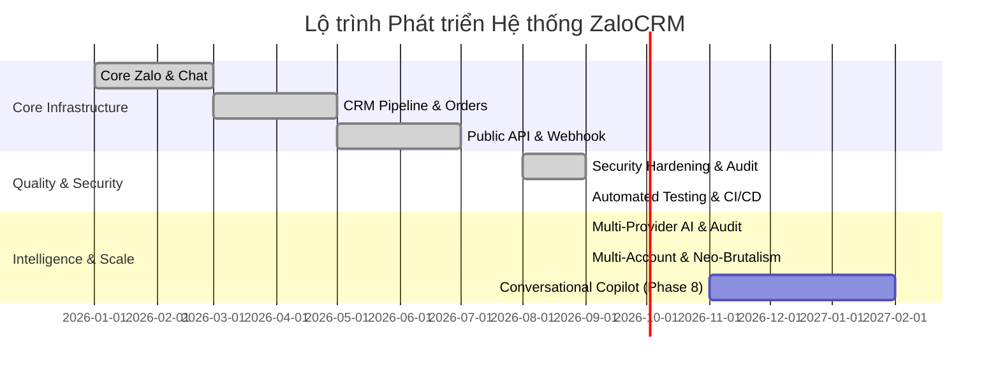

# ZaloCRM — Product & Technical Development Roadmap

## 1. Tổng Quan Lộ Trình (Roadmap Summary)

Lộ trình phát triển **ZaloCRM** được chi làm 6 giai đoạn chiến lược, tập trung từ việc ổn định kết nối đa Zalo cá nhân, mở rộng tính năng CRM quản lý khách hàng, tích hợp API công khai cho tới nâng cao hạ tầng bảo mật, tự động hóa kiểm thử và tích hợp trí tuệ nhân tạo (AI Assistant).

---

## 2. Chi Tiết Các Giai Đoạn (Detailed Phases)

### Phase 1: Core Multi-Zalo & Real-time Chat (ĐÃ HOÀN THÀNH)
- [x] Quản lý đa tài khoản Zalo cá nhân (Đăng nhập QR, lưu session AES-256).
- [x] Giao diện Live Chat real-time qua Socket.IO (gửi/nhận tin nhắn, ảnh, file, sticker, hội thoại nhóm).
- [x] Phân quyền người dùng (Owner, Admin, Member) và bảng kiểm soát truy cập Zalo (`ZaloAccountAccess`).

### Phase 2: CRM Pipeline, Appointments & Reports (ĐÃ HOÀN THÀNH)
- [x] Đường ống quản lý khách hàng (Pipeline 5 trạng thái).
- [x] Đặt lịch hẹn và tự động nhắc lịch hẹn chạy ẩn hàng ngày (`startAppointmentReminder`).
- [x] Thống kê Dashboard & Xuất báo cáo hiệu suất ra file Excel (`exceljs`).

### Phase 3: Public REST API & Webhook Gateway (ĐÃ HOÀN THÀNH)
- [x] Khởi tạo hệ thống REST API công khai xác thực bằng `X-API-Key`.
- [x] Hệ thống gửi thông báo sự kiện qua Webhook cho ứng dụng bên ngoài.

---

### Phase 4: Hardening Bảo Mật & Chuẩn Hóa Quy Trình Build (ĐÃ HOÀN THÀNH)
- [x] Đóng toàn bộ 10 phát hiện (4 HIGH, 5 MEDIUM, 1 LOW) từ đợt audit sau remediation (commit `d075642`).
- [x] Đồng bộ các lệnh build, dev, typecheck thông qua file `package.json` tại root repository.
- [x] Sửa tenant/RBAC/ACL ở Orders, Zalo, Chat, Socket.IO và AI Reports; member vẫn xem toàn bộ contact nhưng dữ liệu Zalo/AI phải theo account ACL.
- [x] Chặn SSRF ở webhook/attachment downloader (`outbound-url-policy.ts`) và giới hạn tài nguyên parser/download stream.
- [x] Chuẩn hóa một root workspace `package-lock.json`; bỏ dependency vào lockfile backend/frontend riêng và dùng cùng graph trong Docker/CI.
- [x] Nâng Node.js 20 đã EOL; Node.js 24 LTS đã áp dụng. Hai advisory upstream trong Prisma 7.10 được chấp nhận có điều kiện qua allowlist nghiêm ngặt (`scripts/audit-production-policy.mjs`).
- [x] Chuyển đổi quy trình Docker Production sang `prisma migrate deploy` với image migrator độc lập, nâng cao tính toàn vẹn dữ liệu.
- [x] Áp dụng tài khoản phi đặc quyền `USER node` trong container ứng dụng và cấu hình loopback port binding.

---

### Phase 5: Kiểm Thử Tự Động & CI/CD Pipeline (ĐÃ HOÀN THÀNH)
- [x] Bổ sung Vitest unit/contract tests cho policy outbound, secret codec, AI job bounds và các security/runtime invariant (bộ test đạt 218 unit tests sạch sẽ).
- [x] Bổ sung browser smoke Playwright (10 spec files) xác nhận login route, QR intent, chat recovery, target qualification và không khôi phục bearer token qua persistent storage.
- [x] Bổ sung bộ 20 integration test suites chạy trên PostgreSQL 16 disposable cho tenant isolation, socket delivery, message replay/undo, order code counter và AI budget/resend.
- [x] Tích hợp GitHub Actions (`.github/workflows/ci.yml`) chạy root `npm ci`, typecheck, backend test, build, production audit, Playwright smoke và Docker build trên pull request/main.
- [x] Bổ sung các kịch bản kiểm chứng container smoke: `npm run verify:production-container` và `npm run verify:development-compose`.

---

### Phase 6: Multi-Provider AI Engine & Báo Cáo Giám Sát Nhóm (ĐÃ HOÀN THÀNH)
- [x] **Hạ tầng AI Đa Nhà Cung Cấp (Multi-Provider Engine):** Hỗ trợ Google Gemini, OpenAI (GPT-4o/mini), DeepSeek (Chat/Reasoner), và Custom OpenAI-Compatible Gateway (Ollama/vLLM/LiteLLM) với cơ chế tự động chuyển vùng dự phòng (Failover) và đo độ trễ (latency tracking).
- [x] **Bảo vệ Mạng & Phòng Chống SSRF:** Module `validateCustomAiGatewayUrl` cô lập triệt để hạ tầng mạng nội bộ; cấm truy cập private IPs/loopback/cloud metadata trừ khi biến `ALLOW_PRIVATE_AI_GATEWAYS=true` được bật tường minh.
- [x] **Lấy Mẫu Đa Phương Thức Đột Biến (Multimodal Burst Sampling):** Pool worker 4 kết nối đồng thời, giới hạn tệp ảnh đính kèm 12MB, khử trùng lặp URL nguồn, và bộ lọc khử khuẩn phòng ngừa Prompt Injection (`sanitizeConversationHistory`).
- [x] **Đối Soát Chéo Hai Tầng (Two-Tier Cross-Verification):**
  - Tầng 1: Chỉ thị kiểm toán đối soát hình ảnh và hội thoại trực quan.
  - Tầng 2: Trích xuất nhiệm vụ hành động chuẩn hóa JSON (`[TASKS_JSON]`) gồm tiêu đề, mức độ ưu tiên (`high`, `medium`, `low`), người phụ trách, hạn chót.
- [x] **Lập Lịch Kiểm Toán Tự Động (AI Group Audit Rules):** Hỗ trợ lập lịch định kỳ tự động phân tích các nhóm Zalo vận hành trọng yếu và tạo báo cáo AI độc lập.
- [x] **Phát Tin Nhiệm Vụ Đến Nhóm Zalo (Action Items Broadcast):** Endpoint `POST /api/v1/ai-reports/:id/broadcast-tasks` cho phép chọn tài khoản phát tin và nhóm Zalo nhận việc trực tiếp từ giao diện báo cáo với báo cáo tiến độ thời gian thực.

---

### Phase 7: Nâng Tầm Trải Nghiệm Đa Tài Khoản & Chuẩn Giao Diện CQA Neo-Brutalism (ĐÃ HOÀN THÀNH)
- [x] **Thanh Điều Hướng Đa Tài Khoản Dọc (`AccountRail.vue`):** Hiển thị trực quan toàn bộ tài khoản Zalo kết nối với avatar, monogram thông minh, chấm trạng thái trực tuyến/ngoại tuyến, số đếm tin chưa đọc hợp nhất (`ALL`) và riêng biệt.
- [x] **Phân Loại Chi Nhánh & Bảng Màu Nhận Diện (`branchTag` & `colorTag`):** Bổ sung trường dữ liệu `branchTag` và `colorTag` trong Prisma Schema; hỗ trợ bảng màu 12 sắc thái Neo-Brutalism với thuật toán băm xác định màu và tự động tính tương phản chữ.
- [x] **Đồng Bộ Tin Nhắn Gửi Đi Từ Thiết Bị Ngoài (`selfListen: true`):** Lắng nghe và đồng bộ hóa lập tức các tin nhắn gửi đi từ điện thoại/máy tính cá nhân của nhân viên vào CRM theo cơ chế `idempotent upsert` kèm phát Socket real-time.
- [x] **Tự Phục Hồi Danh Bạ (Self-Healing Contacts):** Cơ chế tự động bù đắp và cập nhật tên hiển thị, ảnh đại diện Zalo của khách hàng khi tiếp nhận gói tin nhắn mới.
- [x] **Ngôn Ngữ Thiết Kế Neo-Brutalism Chuẩn CQA:** Loại bỏ 100% bóng mờ (zero shadow), áp dụng viền cơ học 1.5px, chuẩn hóa bán kính bo góc CQA (12px cho cards/dialogs/tables/chat bubbles, 8px cho nút/inputs, 9999px cho pills), phông chữ Space Grotesk in nghiêng đậm và bộ 41 Custom SVG Icons.

---

### Phase 8: Trợ Lý Ảo Bán Hàng & Tự Động Hóa Hội Thoại Nâng Cao (KẾ HOẠCH BẮT ĐẦU 11/2026 - 02/2027)
- [ ] Gợi ý câu trả lời thông minh theo ngữ cảnh (Contextual Smart Replies) trực tiếp trong khung chat cho nhân viên tư vấn.
- [ ] Phân tích tâm lý khách hàng thời gian thực (Real-time Sentiment & Buying Intent Scoring).
- [ ] Tự động bóc tách thông tin khách hàng và tạo nhanh Đơn hàng / Lịch hẹn qua AI Tool Calling.
- [ ] Hệ thống Cảnh báo Bất thường (Anomaly Alerting) khi phát hiện xung đột hoặc khách hàng khiếu nại gay gắt.
