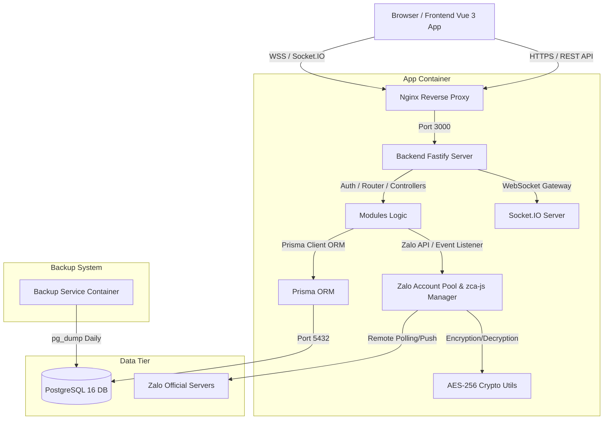
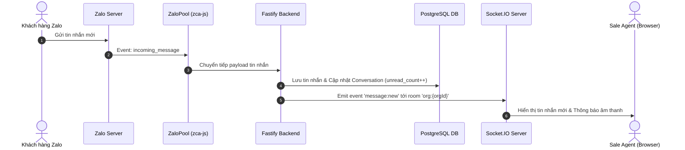

# ZaloCRM — System Architecture & Design Specification

## 1. High-Level System Architecture

Hệ thống **ZaloCRM** được thiết kế theo kiến trúc Monolith hiện đại, chia tách rõ ràng giữa Frontend (Vue 3 Single Page Application) và Backend (Node.js Fastify REST API + WebSocket Server), lưu trữ dữ liệu tập trung trên cơ sở dữ liệu quan hệ PostgreSQL 16.

---

## 2. Các Thành Phần Chính (Core Components)

### 2.1. Web Frontend Layer (Vue 3 + Vuetify 3)
- **Công nghệ:** Vue 3 (Composition API, `<script setup>`), Vuetify 3 UI Framework, Pinia State Management, Vue Router, Chart.js, Socket.IO Client.
- **Vai trò:** Hiển thị giao diện người dùng, quản lý trạng thái client, nhận sự kiện real-time (tin nhắn mới, cập nhật danh bạ, trạng thái Zalo) để cập nhật DOM tức thì mà không cần reload trang.

### 2.2. API & WebSocket Server (Fastify + Socket.IO)
- **Fastify Framework:** Lựa chọn nhờ tốc độ xử lý vượt trội, hệ sinh thái plugin mạnh mẽ (`@fastify/jwt`, `@fastify/cors`, `@fastify/rate-limit`, `@fastify/static`).
- **Real-time Gateway:** Socket.IO tích hợp trực tiếp trên server HTTP của Fastify, xác thực kết nối bằng JWT Token.

### 2.3. Zalo Account Connection Pool (`ZaloPool`)
- **Quản lý đa phiên Zalo:** `ZaloPool` duy trì danh sách các thể hiện (instances) của thư viện `zca-js` cho từng tài khoản Zalo đang hoạt động.
- **Tự động khôi phục (Auto-reconnect):** Khi khởi động server, `ZaloPool` giải mã dữ liệu session (cookie, IMEI) từ DB và tự động tái lập kết nối với Zalo Server.

### 2.4. Data Storage & Persistence (PostgreSQL 16 + Prisma ORM)
- **PostgreSQL 16:** Cơ sở dữ liệu quan hệ chính lưu trữ thông tin Tổ chức, Người dùng, Tài khoản Zalo, Khách hàng, Cuộc trò chuyện, Tin nhắn, Lịch hẹn, Đơn hàng và Nhật ký hoạt động.
- **Prisma 7 ORM:** Quản lý Schema, khởi tạo Migration và tương tác dữ liệu an toàn phòng chống SQL Injection.

---

## 3. Luồng Dữ Liệu & Xử Lý Sự Kiện (Data Flows)

### 3.1. Luồng Tin nhắn Đến (Incoming Message Flow)

### 3.2. Luồng Mã Hóa & Bảo Mật Phiên Zalo (Session Encryption Flow)
1. Khi người dùng quét mã QR thành công, `zca-js` trả về đối tượng `sessionData` chứa `cookie`, `imei`, `userAgent`.
2. Hệ thống gọi `encryptData(sessionData, ENCRYPTION_KEY)` mã hóa chuỗi JSON thành binary bằng thuật toán `AES-256-GCM` với IV ngẫu nhiên và Auth Tag.
3. Chuỗi mã hóa được lưu vào cột `session_data` trong bảng `zalo_accounts`.
4. Khi khởi động lại hệ thống, hàm `decryptData` sử dụng `ENCRYPTION_KEY` để giải mã dữ liệu an toàn.

---

## 4. Bảo Mật Kiến Trúc (Security Architecture)

- **Cô Lập Mạng (Network Isolation):** Container ứng dụng Fastify chỉ lắng nghe kết nối nội bộ (`127.0.0.1:3080`). Chỉ Nginx Reverse Proxy được tiếp nhận lưu lượng mạng công cộng qua cổng 80/443.
- **Bảo Mật Quyền Truy Cập (Multi-Tenant Isolation):** Mọi truy vấn database đều bắt buộc lọc theo `orgId` của người dùng đã xác thực JWT (`request.user.orgId`).
- **Kiểm Soát Quyền Truy Cập Zalo (ACL):** Bảng `zalo_account_access` quản lý chính xác người dùng nào (`userId`) có quyền tương tác với tài khoản Zalo nào (`zaloAccountId`).
