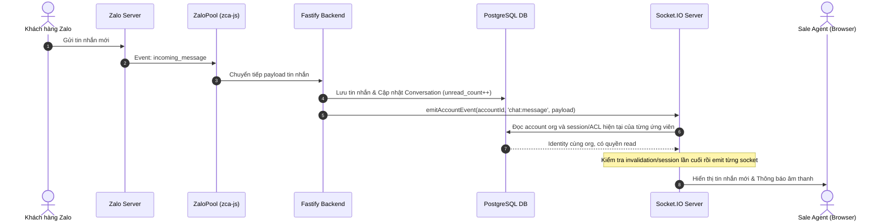
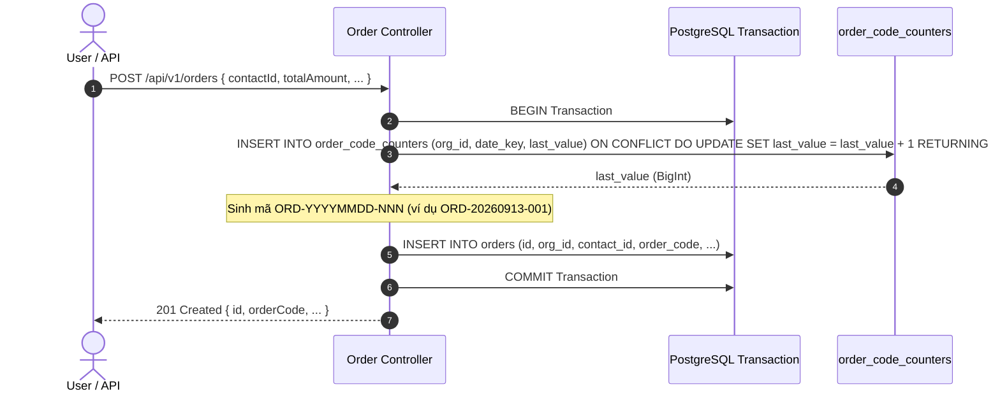
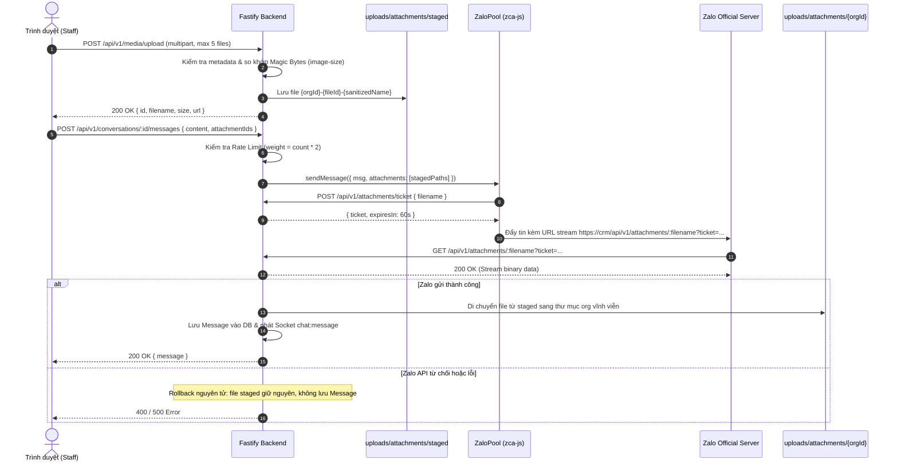

# ZaloCRM — System Architecture & Design Specification

## 1. High-Level System Architecture

Hệ thống **ZaloCRM** được thiết kế theo kiến trúc Monolith hiện đại, chia tách rõ ràng giữa Frontend (Vue 3 Single Page Application) và Backend (Node.js Fastify REST API + WebSocket Server), lưu trữ dữ liệu tập trung trên cơ sở dữ liệu quan hệ PostgreSQL 16.

```mermaid
graph TD
    Client[Browser / Frontend Vue 3 App] -->|HTTPS / REST API| Nginx[Nginx / Cloudflare Reverse Proxy]
    Client -->|WSS / Socket.IO| Nginx
    
    subgraph Host / Docker Environment
        Nginx -->|Loopback 127.0.0.1:3080| Fastify[Backend Fastify 5 Server (Port 3000 in container)]
        Fastify -->|Auth / Router / Controllers| Modules[Modules Logic]
        Fastify -->|WebSocket Gateway| SocketIO[Socket.IO Server]
        
        Modules -->|Zalo API / Event Listener| ZaloPool[Zalo Account Pool & zca-js Manager]
        ZaloPool -->|Encryption/Decryption| CryptoUtils[AES-256 Crypto Utils]
        
        Modules -->|Prisma Client ORM| Prisma[Prisma 7 ORM]
    end

    subgraph Data Tier
        Prisma -->|Port 5432 / 127.0.0.1:5433| Postgres[(PostgreSQL 16 DB)]
        ZaloPool -->|Remote Push/Poll| ZaloServer[Zalo Official Servers]
    end

    subgraph Backup System
        Cron[Backup Service Container] -->|pg_dump Daily| Postgres
    end
```

---

## 2. Các Thành Phần Chính (Core Components)

### 2.1. Web Frontend Layer (Vue 3 + Vuetify 4 + Neo-Brutalism CQA)
- **Công nghệ & Phong cách:** Vue 3 (Composition API, `<script setup>`), Vuetify 4 UI Framework, Pinia State Management, Vue Router, Chart.js, Socket.IO Client.
- **Ngôn ngữ Thiết kế Neo-Brutalism chuẩn CQA:** Triệt tiêu hoàn toàn bóng mờ ảo (100% Zero Shadow), đường viền cơ học 1.5px dứt khoát, phản hồi click xúc giác (`translate(1px, 1px)`), bán kính bo góc chuẩn CQA (12px card/dialog/table/chat bubble, 8px button/input/icon-box, 9999px pill badge). Hệ thống biểu tượng Custom SVG Icons độc lập (`custom-icons.ts`) và Brand SVG Icons chính hãng cho các AI provider.
- **Thanh Điều Hướng Đa Tài Khoản Dọc (`AccountRail.vue`):** Cho phép chuyển đổi tức thì giữa các tài khoản Zalo chỉ với 1 click, hiển thị viền màu đại diện (`colorTag`), nhãn chi nhánh (`branchTag`), trạng thái live và badge đếm tin nhắn chưa đọc tổng hợp.
- **Vai trò:** Hiển thị giao diện người dùng, quản lý trạng thái client, nhận sự kiện real-time (tin nhắn mới, cập nhật danh bạ, trạng thái Zalo) để cập nhật DOM tức thì mà không cần reload trang. Token JWT ngắn hạn được giữ hoàn toàn trong RAM client (`session.ts`), không ghi vào bộ nhớ bền vững.

### 2.2. API & WebSocket Server (Fastify + Socket.IO)
- **Fastify Framework:** Lựa chọn nhờ tốc độ xử lý vượt trội, hệ sinh thái plugin mạnh mẽ (`@fastify/jwt`, `@fastify/cors`, `@fastify/rate-limit`, `@fastify/static`, `@fastify/cookie`).
- **Real-time Gateway:** Socket.IO tích hợp trực tiếp trên server HTTP của Fastify, xác thực kết nối bằng JWT Token chứa `sessionId` và kiểm tra trạng thái session thực trong PostgreSQL.
- **App factory:** `backend/src/app-factory.ts` dựng cùng HTTP routes và Socket.IO production cho ứng dụng và integration fixture; entrypoint `app.ts` sở hữu việc khởi động worker, cron và Zalo listeners.

### 2.3. Zalo Account Connection Pool (`ZaloPool`) & Session Manager
- **Quản lý đa phiên Zalo:** `ZaloPool` duy trì danh sách các thể hiện (instances) của thư viện `zca-js` cho từng tài khoản Zalo đang hoạt động.
- **Tự động khôi phục (Auto-reconnect):** Khi khởi động server, `ZaloPool` giải mã dữ liệu session (cookie, IMEI) từ DB và tự động tái lập kết nối với Zalo Server, có cơ chế giãn cách (stagger 10s) tránh rate limit.
- **Duy trì phiên & Heartbeat định kỳ (`zalo-session-manager`):** Khởi động timer `setTimeout` đệ quy mỗi 1 giờ (±60s jitter) gọi `api.keepAlive()` để ngăn Zalo ngắt kết nối session idle. Tự động trích xuất cookie mới nhất từ `CookieJar`, bảo lưu IMEI/UserAgent từ `api.getContext()` và mã hóa AES-256-GCM lưu bền vững vào PostgreSQL.
- **Kiên cường kết nối & Chống Flapping:** Cơ chế retry exponential backoff tường minh `[30s, 2m, 5m]` cho các lỗi mạng tạm thời mà không gán `qr_pending` tức thì; chỉ chuyển `qr_pending` khi vượt quá 3 lần thử thất bại liên tiếp hoặc gặp lỗi fatal auth (`isFatalAuthError`). Duy trì circuit breaker `disconnectHistory` (cửa sổ trượt 5 phút) để bảo vệ tài khoản khi socket bị flapping liên tục.

### 2.4. Data Storage & Persistence (PostgreSQL 16 + Prisma 7 ORM)
- **PostgreSQL 16:** Cơ sở dữ liệu quan hệ chính với 24 Data Models phân tách theo nghiệp vụ:
  - *Đa tổ chức & Người dùng:* `Organization`, `Team`, `User`
  - *Phiên xác thực bền vững:* `AuthSession` (lưu SHA-256 hash của refresh token, quản lý xoay vòng và family revocation)
  - *Tài khoản Zalo & Phân quyền:* `ZaloAccount` (hỗ trợ `branchTag`, `colorTag`, lưu session mã hóa AES-256-GCM), `ZaloAccountAccess` (quyền read, chat, admin)
  - *Khách hàng & Hội thoại:* `Contact`, `Conversation`, `Message` (hỗ trợ deduplication theo `conversationId_zaloMsgId`)
  - *Lịch hẹn:* `Appointment`
  - *Đơn hàng & Cấp mã tuần tự:* `Order`, `OrderCodeCounter` (cấp mã nguyên tử theo org/ngày UTC)
  - *Báo cáo Điều hành AI Digest v2:* `GroupReportConfig`, `GeneratedReport`, `AiReportJob`, `AiReportJobDispatch`, `AiReportBudgetReservation`, `AiReportResend`, `AiReportResendDispatch`
  - *AI Telemetry & Đo lường Chi phí:* `AiUsageLog` (nhật ký giao dịch token từng tác vụ AI), `DailyAiUsageStat` (tổng hợp chi phí ngày atomic UTC+7)
  - *Vận hành & Kiểm toán:* `AppSetting` (mã hóa AES-256-GCM các secret), `DailyMessageStat`, `ActivityLog`
- **Prisma 7 ORM:** Quản lý Schema, khởi tạo Migration có version và tương tác dữ liệu an toàn phòng chống SQL Injection. Tương thích schema được kiểm chứng lúc khởi động bằng `schemaIsCompatible()`.

---

## 3. Luồng Dữ Liệu & Xử Lý Sự Kiện (Data Flows)

### 3.1. Luồng Tin nhắn Đến (Incoming Message Flow)


Room `org:{orgId}` chỉ chọn ứng viên, không cấp quyền nhận payload. Chat/status cần session DB hợp lệ và quyền `read` hiện tại trên account; không yêu cầu subscribe. Owner/Admin bypass grant chỉ trong organization của mình. Thiếu account/context hoặc lỗi kiểm tra DB thì từ chối gửi, không fallback broadcast toàn cục.

### 3.1.1. QR, reminder và khôi phục realtime

- `zalo:qr`, `zalo:qr-expired`, `zalo:scanned` cần quyền account `admin` hiện tại và intent subscribe còn hiệu lực ở server. Client chờ ack `zalo:subscribe` thành công trước HTTP login; reconnect khôi phục intent của dialog còn mở, unsubscribe/cancel vô hiệu hóa yêu cầu đang chờ.
- `appointment:reminder` dùng `apt.orgId` đọc từ DB và kiểm tra session/org của từng người nhận qua `emitOrganizationEvent`. Visibility vẫn toàn organization, kể cả người không được assign; cập nhật reminder flag theo cả `id` và `orgId`.
- Account delivery được tuần tự hóa theo account, giới hạn 100 sự kiện đang giữ; overflow gộp tín hiệu `realtime:resync-required` chỉ chứa reason/generation. Frontend tải lại conversation list và conversation đang mở qua REST khi có tín hiệu hoặc reconnect, gộp fetch và dùng ACL hiện hành để loại dữ liệu không còn quyền. Queue này không phải durable event log.
- ACL/account mutation vô hiệu hóa thao tác đang chờ trước response thành công; session revoke vô hiệu hóa cả handshake đang chờ. Delivery kiểm tra lại trạng thái ngay trước emit, không giữ cache quyền dương lâu dài.
- Bảo đảm invalidation hiện giới hạn **một backend process với Socket.IO default adapter**. Cần shared invalidation và kiểm chứng riêng trước khi dùng nhiều replica/distributed adapter.

### 3.1.2. Message replay, self-listen và thu hồi

- **Self-listen từ thiết bị ngoài:** Zalo SDK khởi tạo với `selfListen: true` để lắng nghe tin nhắn gửi từ iPad/điện thoại (`isSelf: true`). Listener bỏ qua self-reaction/typing, tự động tra cứu thông tin người nhận (`getUserInfo` timeout 3s) và đồng bộ real-time lên Dashboard (`senderType: 'self'`).
- **Deduplication & Race Condition:** Trích xuất `zaloMsgId` đa tầng từ response `sendMessage`. Nếu WebSocket echo dội về trước khi API route lưu DB, route bắt lỗi `P2002` và cập nhật lại `repliedByUserId` cùng `senderName` của nhân viên.
- **Tự lành hội thoại & Contact:** Hội thoại có `contactId: null` tự động liên kết với Contact khi có tin nhắn mới. Khi khách hàng phản hồi, tên Contact tự động cập nhật từ tên thật trên Zalo nếu trước đó là tên mặc định ('Khách Zalo').
- **Rate Limit Pacing:** Cache dedup `zaloMsgId` (TTL 60s) chống đếm x2. Tin nhắn từ iPad chỉ tính vào hạn mức ngày (200 tin/ngày), không làm kẹt nhịp gửi (burst 3 tin/30s, delay 2s) của nhân viên trên Dashboard. Hỗ trợ tham số `force: true` gửi khẩn cấp khi vượt 200 tin/ngày.
- **Message replay & Undo:** Transaction ingestion khóa hội thoại và unique `(conversationId, zaloMsgId)` để một sự kiện phát lại không tạo message, tăng unread, tải attachment, phát socket hoặc webhook lần nữa. Undo tìm conversation bằng org/account/thread trước khi cập nhật message (`isDeleted: true`, `deletedAt: new Date()`); cùng mã tin nhắn ở hội thoại khác không bị thu hồi theo.

### 3.1.3. Nguồn AI, ngân sách và delivery

Generate resolve từng cặp account/thread thành snapshot `(orgId, zaloAccountId, groupThreadId, conversationId)` bất biến. Selector chỉ có thread được hỗ trợ khi duy nhất trong org; mơ hồ trả `409`. Job v2, archive và cấu hình dùng cùng định danh nguồn. Đọc cần quyền `read`; generate/delivery cần quyền `chat`, cấu hình nhóm cần `admin`. Sender là account được chọn tường minh, không dùng account kết nối đầu tiên.

Worker kiểm tra ngân sách trước từng provider attempt, bao gồm attachment-expanded context, map/reduce/final và retry. Reservation được persist với lease fence để recovery không đặt lại ngân sách. Trước mỗi Zalo part và email send, guard kiểm tra quyền hiện tại và ownership/cancellation/lease tương ứng; request SDK đã bắt đầu không thể thu hồi.

Resend lưu attempt và dispatch ledger dưới idempotency key; replay trả ledger, không gửi lại. Kết quả partial/uncertain phải đối soát người nhận trước khi người dùng tạo lượt mới. Hệ thống không bảo đảm exactly-once đối với dịch vụ gửi bên ngoài.

Cutover giữ config không resolve ở `needs_resolution`, không chạy lịch cho nguồn đó; report cũ `legacy_unverified` chỉ Owner/Admin cùng org đọc và không resend. Job v1 chưa terminal chuyển failed, giữ payload/result và ledger claimed/sent; không tự khởi chạy lại. Shutdown đóng admission rồi chờ producer/cron/worker/send trước migration; timeout chặn cutover. Xem [deployment guide](deployment-guide.md).

### 3.1.4. Luồng Cấp Mã Đơn Hàng Nguyên Tử (Atomic Order Code Flow)



- Mã đơn hàng được tạo nguyên tử trong cùng transaction tạo bản ghi `Order`. Lệnh `INSERT INTO order_code_counters ... ON CONFLICT DO UPDATE` khóa dòng theo cặp `(org_id, date_key)` (ngày tính theo chuẩn UTC `YYYYMMDD`), bảo đảm không có race condition hay trùng mã khi nhiều nhân viên tạo đơn cùng lúc.
- Khóa Unique `(org_id, order_code)` ở mức database đóng vai trò chốt chặn cuối cùng bảo vệ toàn vẹn dữ liệu.

### 3.1.5. Động cơ AI Đa Nhà Cung Cấp (Multi-Provider Engine), SSRF, Burst Sampling & Two-Tier Verification

- **Bộ điều phối thích ứng (AiProviderRouter):** Trừu tượng hóa các adapter AI độc lập (`GeminiProvider`, `OpenAiCompatibleProvider` cho OpenAI, DeepSeek và Custom AI Gateway). Hỗ trợ cấu hình động theo từng tổ chức hoặc kế thừa cấu hình mặc định an toàn từ hệ thống (mặc định: Primary là DeepSeek `deepseek-flash`, chuỗi failover là `['gemini', 'openai']`).
- **Duy nhất một lần đặt trước ngân sách (Single-Layer Budget Reservation):** Khi tiến hành failover sang provider tiếp theo trong chuỗi dự phòng (`fallbackChain`), router tái sử dụng cùng một `attemptKey` đã đặt trước với `ReportJobBudget`. Ngân sách token chỉ được hoàn tất (`complete`) một lần khi một provider thành công, loại bỏ hoàn toàn nguy cơ nhân đôi chi phí (double-reserve) hoặc làm cạn kiệt ngân sách của tổ chức.
- **Cơ chế phòng chống SSRF trên AI Gateway:** Mọi Base URL tùy chỉnh của bên thứ ba khi lưu hoặc kiểm tra kết nối đều phải vượt qua `validateAiGatewayUrl`. Hệ thống mặc định bắt buộc giao thức HTTPS và phân giải DNS nhằm chặn mọi dải IP loopback, private (RFC1918) và link-local. Việc kết nối tới AI Gateway mạng cục bộ (Ollama, vLLM, LocalAI) chỉ được chấp thuận khi cờ môi trường `ALLOW_PRIVATE_AI_GATEWAYS=true` được cấu hình tường minh.
- **Cầu nối thị giác lai thông minh (Smart Hybrid Vision Bridge) & Multimodal Trực tiếp:** Với `deepseek-flash`, hệ thống gửi ảnh trực tiếp dưới dạng OpenAI-compatible base64 `image_url` mà không qua bridge. Đối với các mô hình thuần văn bản (như DeepSeek-V3), `preprocessMultimodalPrompt` tự động điều phối ảnh tới provider thị giác khả dụng để OCR trích xuất số liệu/chứng từ (loại trừ các provider đã lỗi trong chuỗi failover nhằm chống deadlock), hoặc tự động suy thoái nhẹ nhàng (graceful degradation) chèn ghi chú placeholder thay vì làm gián đoạn toàn bộ tiến trình tổng hợp báo cáo.
- **Phân tích Ảnh 2 Bước & Bộ trích xuất Sự thật Thị giác Độc lập (Two-Step Visual Fact Extraction):**
  - **Khử trùng lặp & Ngữ cảnh 2 chiều (Bidirectional Burst Sampling):** `attachment-burst-sampler.ts` khử trùng lặp ảnh, hỗ trợ cửa sổ ngữ cảnh 2 chiều `[-60s, +60s]` kèm Anti-Interleaving (chỉ gán tin nhắn văn bản sau ảnh cho ảnh sát nhất ngay trước tin nhắn).
  - **Bước 1 — Trích xuất Sự thật Thị giác (Visual Fact Extractor):** `visual-fact-extractor.ts` bóc tách ảnh thành cấu trúc JSON nghiêm ngặt `VerifiedVisualFact` (`objects`, `visualCondition`, `measuringDevice`, `textLabels`, `evidenceSummary`) hoàn toàn tách biệt khỏi văn bản chat để triệt tiêu thiên kiến xác nhận. Tích hợp In-Memory LRU Cache TTL 24h, cô lập đa tổ chức tuyệt đối theo key `${orgId}:${sha256(buffer)}`.
  - **Bước 2 — Đối chiếu Grounded & Ngăn ngừa Ảo giác (Grounded Map-Reduce):** Đưa khối `<verified_visual_evidence>` vào prompt Tier 1 Map và Reduce của `summarizer-service.ts`, loại bỏ hoàn toàn binary ảnh ở Tier 1. Ràng buộc model tuân thủ nguyên tắc suy đoán vô tội: nếu ảnh không có cân, tuyệt đối cấm bịa số cân.
  - **Phân loại Mức độ Action Items:** `report-action-item-parser.ts` phân định rõ 2 mức độ: 🔴 Sai lệch số liệu thực tế (`anomaly_fraud` - Ưu tiên Cao) vs 🟡 Thiếu chứng từ kiểm chứng (`compliance_missing_evidence` - Ưu tiên Trung bình), hiển thị badge trực quan trên giao diện `AiReportsView.vue`.
- **Cô lập & mã hóa cấu hình đa người dùng:** Dữ liệu cấu hình và API key của từng tổ chức được mã hóa `AES-256-GCM` trong bảng `AppSetting` (`settingKey: 'ai_provider_config'`). API DTO luôn che giấu (`maskKey`) các secret và tuyệt đối không làm lộ khóa cấu hình cấp hệ thống của máy chủ cho client.

### 3.1.6. Trợ Lý Ảo Bán Hàng (Conversational Copilot Architecture)

- **Single-Inference Unified Engine:** 1 lần gọi suy luận duy nhất sinh đồng thời 4 chiều nghiệp vụ (Tâm lý khách & điểm ý định mua hàng 0-100, 3 gợi ý phản hồi theo ngữ cảnh kèm phím tắt `Alt+1/2/3`, thông tin bóc tách đơn hàng/lịch hẹn, và cảnh báo bất thường/khiếu nại). Bỏ qua lớp budget reservation của AI Reports nặng nề để đạt độ trễ < 1.5s, tích hợp LRU Cache In-Memory (500 entries, 5m TTL).
- **Smart Turn Debouncer (3.0s) & Race Guard:** Nhận diện tin nhắn vụn vặt của khách hàng, hoãn gọi LLM tới 3.0 giây sau tin nhắn cuối cùng (tùy chỉnh 1.5s - 5.0s theo cấu hình org, trần tối đa 12s tránh trễ vô hạn). Tự động huỷ bộ đếm và ngắt luồng AI đang chạy (`AbortController`) ngay khi nhân viên bấm gửi tin nhắn phản hồi (`isSelf: true`).
- **Phòng chống Prompt Injection & Ảo giác Giá:** Khử độc và bọc kín tin nhắn khách hàng trong thẻ XML `<customer_utterance>`. Bắt buộc không tự bịa đặt giá nếu không có dữ liệu đối chiếu trong ngữ cảnh doanh nghiệp.
- **Quy trình Phê Duyệt Human-in-the-Loop:** Dữ liệu bóc tách đơn hàng, địa chỉ giao hàng và lịch hẹn được hiển thị qua thẻ `ChatAiDraftCard.vue`. Nhân viên bấm click để mở modal điền sẵn 100% dữ liệu và chủ động xác nhận commit (tuyệt đối không tự động tạo đơn/lịch hẹn vào DB để ngăn chặn sai sót tài chính).
- **Cảnh báo Bất thường & Leo thang Quản lý (Anomaly Escalation):** Khi phát hiện khách hàng bức xúc gay gắt, chửi bới hoặc dọa báo công an, hệ thống ghim cờ `escalationStatus: 'pending'` vào `metadata` của Contact, kích hoạt dải cảnh báo đỏ `ChatAnomalyBanner.vue` kèm kịch bản xoa dịu mẫu, phát Socket.IO sự kiện `chat:anomaly_alert` tới Owner/Admin và ghi nhật ký kiểm toán vào `ActivityLog`.

### 3.1.7. Kiến Trúc Tin Nhắn Đa Phương Tiện & Streaming Ticket (Two-Way Media Messaging Architecture)



- **Xác thực 4 tầng & Phòng vệ Tệp (Security Defense):** Endpoint đọc stream `/api/v1/attachments/:filename` thẩm định qua 4 cơ chế: Cookie phiên media (`zalo_crm_media_session`), Vé HMAC ngắn hạn (`ticket` 60s), Bearer header hoặc Query token. Chặn triệt để Path Traversal (`isValidAttachmentFilename`, chặn `..`, `/`, `\`, `.`, `staged`), kiểm tra `isFile()` chống lỗi `EISDIR` sập luồng, và cô lập tenant chặt chẽ (`403 Forbidden` khi truy cập chéo org). Trả kèm header `Cache-Control: private, no-transform, max-age=86400`, CSP `default-src 'none'; sandbox` và `X-Content-Type-Options: nosniff`.
- **Tương thích ngược & Di chuyển nguyên tử (Atomic Legacy Migration):** Các tệp cũ trên đĩa server chưa có tiền tố `orgId-` được đối soát quyền sở hữu chính xác qua toán tử chứa JSONB `m.attachments @> jsonb` kết hợp chỉ mục GIN trên cột `attachments` của bảng `messages`. Khi xác minh thuộc về tenant hợp lệ, tệp được di chuyển nguyên tử (`.part` -> `rename`) vào `orgDir` và dọn sạch file gốc tại `baseDir` bằng `unlink`, chống phình dung lượng đĩa và loại trừ race condition.
- **Dọn dẹp tệp mồ côi (`orphan-cleanup-task.ts`):** Cron chạy định kỳ mỗi giờ (`0 * * * *`) quét thư mục `staged` và xóa sạch tệp tải lên quá 2 giờ không có tin nhắn tương ứng gắn kèm, tránh lãng phí dung lượng ổ cứng.

### 3.1.8. Kiến Trúc Telemetry & Quản Lý Chi Phí AI (AI Telemetry & Cost Tracking Architecture)

- **Đánh chặn Telemetry Đa Tác Vụ:** Mọi tác vụ gọi LLM (`copilot`, `executive_report`, `audit_rule`, `vision_ocr`, `test_connection`) được `ai-usage-tracker.ts` ghi nhận chính xác: token đầu vào (`inputTokens`), token đầu ra (`outputTokens`), token bộ nhớ đệm (`cachedTokens`) và thời gian thực thi (`durationMs`).
- **Bảng Định Giá Động (`ai-pricing-catalog.ts`):** Ánh xạ giá token chi tiết theo từng mô hình (`deepseek-flash`, Gemini 2.5/3.6, GPT-4o, GPT-4o-mini, DeepSeek-V3, DeepSeek-R1, Custom Gateway) tính ra USD và quy đổi VNĐ theo tỷ giá định sẵn. Giữ lại giá các model cũ cho mục đích telemetry tương thích ngược.
- **Rollup Nguyên Tử Chống Race Condition:** Sau khi lưu bản ghi nhật ký chi tiết vào `ai_usage_logs`, hệ thống thực thi câu lệnh SQL raw:
  ```sql
  INSERT INTO daily_ai_usage_stats (
    id, org_id, stat_date, task_type, provider, model,
    request_count, input_tokens, output_tokens, cached_tokens, total_tokens,
    cost_usd, cost_vnd, updated_at
  ) VALUES (...)
  ON CONFLICT (org_id, stat_date, task_type, provider, model)
  DO UPDATE SET
    request_count = daily_ai_usage_stats.request_count + 1,
    input_tokens = daily_ai_usage_stats.input_tokens + EXCLUDED.input_tokens,
    output_tokens = daily_ai_usage_stats.output_tokens + EXCLUDED.output_tokens,
    cached_tokens = daily_ai_usage_stats.cached_tokens + EXCLUDED.cached_tokens,
    total_tokens = daily_ai_usage_stats.total_tokens + EXCLUDED.total_tokens,
    cost_usd = daily_ai_usage_stats.cost_usd + EXCLUDED.cost_usd,
    cost_vnd = daily_ai_usage_stats.cost_vnd + EXCLUDED.cost_vnd,
    updated_at = NOW();
  ```
  Bảo đảm tính toàn vẹn số liệu thống kê thời gian thực ngay cả khi có hàng chục lượt suy luận diễn ra đồng thời.
- **Báo cáo & Xuất Dữ Liệu:** Cung cấp KPI cho Dashboard (`GET /api/v1/dashboard/ai-kpi`), tab báo cáo chuyên sâu (`GET /api/v1/reports/ai-usage`) và xuất file Excel (`GET /api/v1/reports/export?type=ai-usage`).

### 3.2. Luồng Mã Hóa & Bảo Mật Phiên Zalo (Session Encryption Flow)
1. Khi người dùng quét mã QR thành công, `zca-js` trả về đối tượng `sessionData` chứa `cookie`, `imei`, `userAgent`.
2. Hệ thống gọi `encryptData(sessionData, ENCRYPTION_KEY)` mã hóa chuỗi JSON thành binary bằng thuật toán `AES-256-GCM` với IV ngẫu nhiên và Auth Tag.
3. Chuỗi mã hóa được lưu vào cột `session_data` trong bảng `zalo_accounts`.
4. Khi khởi động lại hệ thống, hàm `decryptData` sử dụng `ENCRYPTION_KEY` để giải mã dữ liệu an toàn.

---

## 4. Bảo Mật Kiến Trúc (Security Architecture)

- **Cô Lập Mạng (Network Isolation):** Fastify lắng nghe trong container; Docker chỉ publish cổng ứng dụng và PostgreSQL lên loopback của host. Nginx/Cloudflare Tunnel là lớp tiếp nhận traffic public.
- **Bảo Mật Quyền Truy Cập (Multi-Tenant Isolation):** Invariant bắt buộc là mọi truy vấn đọc/ghi phải lọc theo `request.user.orgId` hoặc `orgId` suy ra từ API key đã xác thực.
- **Kiểm Soát Quyền Truy Cập Zalo (ACL):** Bảng `zalo_account_access` là nguồn quyền cho member trên REST và Socket.IO; owner/admin có thể bypass trong phạm vi organization của mình.
- **Contact Visibility:** Mọi role trong cùng organization được xem contact. `assignedUserId` phục vụ phân công/KPI, không phải ranh giới đọc dữ liệu.
- **AI Reports:** Mọi role được sử dụng; member bị giới hạn theo Zalo account ACL, còn owner/admin có phạm vi toàn organization và quản lý cấu hình SMTP/automation.

### 4.1. Ghi nhận lịch sử ngày 2026-09-02

Nội dung dưới đây giữ ghi nhận của đợt remediation cũ, **không phải bằng chứng nghiệm thu hiện tại**. Thay đổi realtime/test harness ngày 2026-09-08 vẫn phải hoàn tất ma trận kiểm chứng trong [Phase 1](../plans/260902-1756-post-remediation-audit-fixes/phase-01-start.md); các thay đổi hiện tại được mô tả phía trên, release toàn bộ vẫn chờ bằng chứng revision cuối.

Release remediation đã đưa tenant scoping, RBAC/ACL Zalo, session rotation và SSRF policy vào các ranh giới backend. Access token có hạn 15 phút và chỉ tồn tại trong memory của browser; refresh token opaque được hash ở server, xoay vòng qua HttpOnly cookie, và bị revoke khi đổi mật khẩu, role hoặc trạng thái hoạt động. Socket.IO tái kiểm tra session và quyền account trong lúc kết nối còn sống.

AI report on-demand chạy qua DB-backed job (giới hạn 31 ngày, 20 group, 10 email recipients; idempotency, lease, cancellation và ngân sách message/token). Webhook và attachment chỉ được phép tới HTTPS public sau DNS/redirect validation. SMTP password và webhook secret được mã hóa; public API key vẫn plaintext/recoverable theo residual-risk waiver, chỉ Owner/Admin xem được, `no-store`, audit và không log giá trị key.

Vitest bảo vệ các policy/contract P1 và Playwright smoke kiểm tra browser không lưu bearer token bền vững. GitHub Actions chạy cùng root workspace install, typecheck, test, build, production audit, frontend smoke và Docker build.
